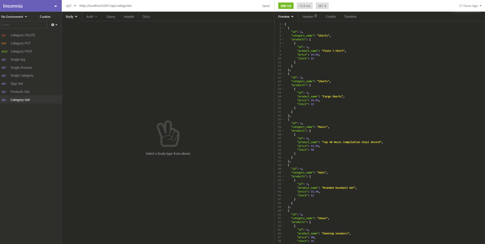

# E-commerce-Back-End

## Description
back end for my e-commerce website that uses the latest technologies

[video](https://drive.google.com/file/d/1IIXB1PRSnRZYgr7PtsErVlHp5Vj2FR3-/view)

## Acceptance Criteria
* WHEN I add my database name, MySQL username, and MySQL password to an environment variable file
THEN I am able to connect to a database using Sequelize
* WHEN I enter schema and seed commands
THEN a development database is created and is seeded with test data
* WHEN I enter the command to invoke the application
THEN my server is started and the Sequelize models are synced to the MySQL database
* WHEN I open API GET routes in Insomnia Core for categories, products, or tags
THEN the data for each of these routes is displayed in a formatted JSON
* WHEN I test API POST, PUT, and DELETE routes in Insomnia Core
THEN I am able to successfully create, update, and delete data in my database

## Installation
- Clone project from Github
- run mysql > source db/schema.sql
- Install dependencies
- run npm seed
- run npm start

## Dependencies

* inquirer
* donenv
* mysql2
* sequelize

[Github](https://github.com/Torabis/E-commerce-Back-End)